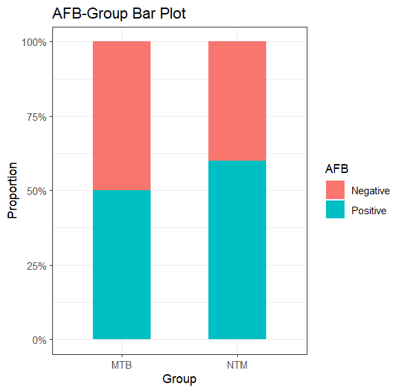
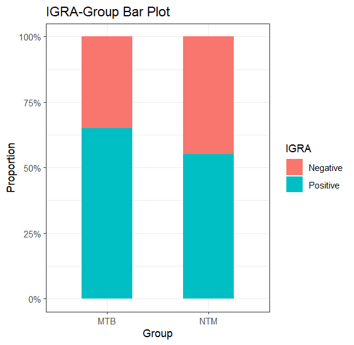
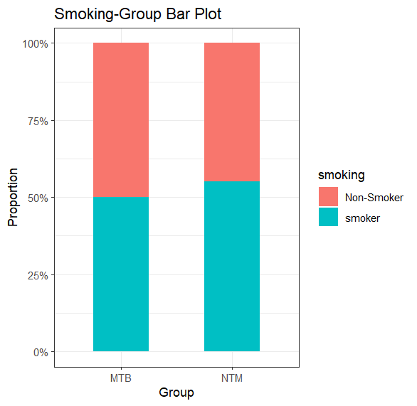

# MTB vs NTM Group: Chi-Square Analysis

This project evaluates the relationship between MTB/NTM groups and three categorical factors:
- AFB status (Positive/Negative)
- IGRA status (Positive/Negative)
- Smoking status (Smoker/Non-Smoker)

## 🔬 Objective
To determine whether there are statistically significant associations between group membership (MTB vs NTM) and the above variables using Chi-Square tests.

## 📊 Methods
- **Test Used:** Pearson’s Chi-Square test
- **Tools:** R, `gtsummary`, `finalfit`, `ggplot2`, `scales`

## 📋 Summary Table
A summary of the dataset and chi-square test results is generated using `summary_factorlist()` from `finalfit`.

## 🧪 Chi-Square Results

| Variable | p-value | Conclusion |
|----------|---------|------------|
| AFB      | 0.7506  | ❌ No significant association |
| IGRA     | 0.7469  | ❌ No significant association |
| Smoking  | 1       | ❌ No significant association |

✅ The null hypothesis was accepted for all three variables.

## 📈 Visualizations

Bar plots showing the proportional distribution between groups:

- 
- 
- 

## 🧾 Interpretation

- None of the three tested characteristics were significantly associated with being in the MTB or NTM group.
- Visual inspection supports the statistical results, with similar proportions observed in both groups.

---
